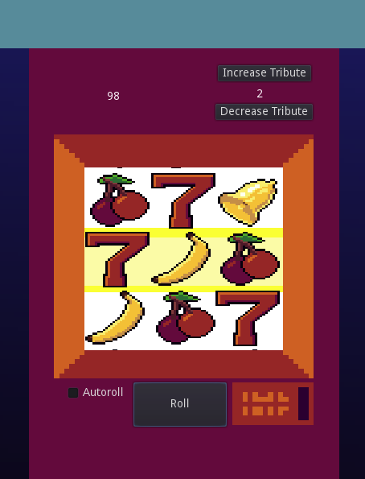
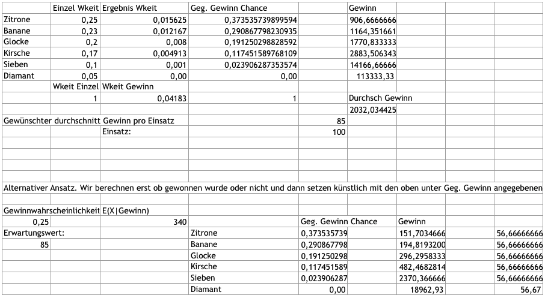

# Godot-Slotmachine
A simple slot machine implementation using Godot 3.1

A rather simple slot machine implementation that should make the player lose about 15% of his input on average. The graphical assets are made by me and are free to be used by anyone.

The following sheet contains all the probabilities.

Additional contributors:
[Kevin Fiegenbaum](https://github.com/DunkingDev) - All the math and probability calculations
